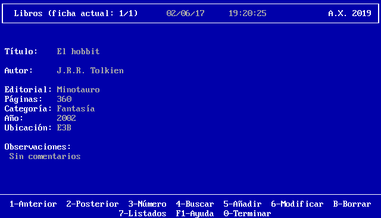

# Biblioteca

## Entrega 01: Añadir a array de structs, guardar y cargar

Esta primera entrega debe contener un array que permita almacenar hasta
2000 structs relacionados con libros (título, autor, editorial, páginas,
categoría, año, ubicación, observaciones). La pantalla principal debe
tener una apariencia parecida a ésta:

En esta primera entrega sólo funcionarán las opciones 5 (Añadir), 1
(ir a la ficha anterior, si existe) y 2 (ir a la ficha posterior, si existe),
así como la 0 (Terminar).

Al salir del programa se deben guardar en fichero los datos. Al entrar al
programa se deben cargar los datos anteriores, si es que existen.

Todavía no es importante la estructura de clases, porque eso se formalizará
en una entrega posterior.
